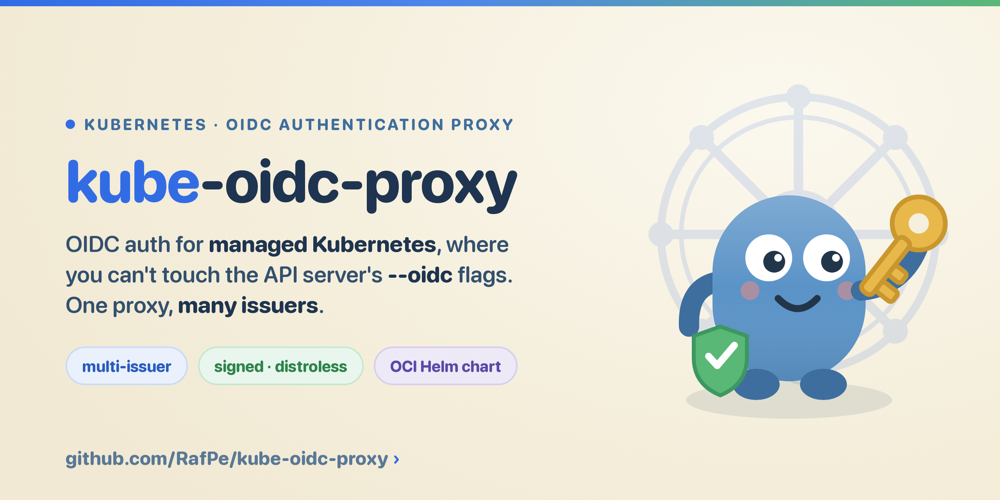
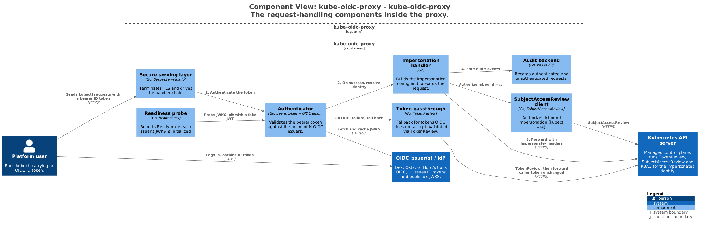

<p align="center">
  
</p>

[](https://github.com/RafPe/kube-oidc-proxy/actions/workflows/build.yaml)
[](https://github.com/RafPe/kube-oidc-proxy/actions/workflows/e2e.yaml)
[](./LICENSE)
[](https://goreportcard.com/report/github.com/rafpe/kube-oidc-proxy)
[](https://securityscorecards.dev/viewer/?uri=github.com/RafPe/kube-oidc-proxy)
[](https://artifacthub.io/packages/search?repo=kube-oidc-proxy)

# kube-oidc-proxy

A reverse proxy that brings OIDC login to managed Kubernetes clusters, with multi-issuer auth in one proxy.

## Why

- **The problem:** managed clusters (EKS, GKE, AKS, …) don't let you set the API server's `--oidc-*` flags, so you can't wire in your own OIDC provider.
- **The fix:** the proxy validates the bearer token and impersonates the user against the API server — your existing RBAC stays authoritative.
- **What's different:** one proxy can accept tokens from many issuers at once via a Kubernetes `AuthenticationConfiguration`.

## Quickstart

Prerequisites: a Kubernetes cluster, `kubectl`, Helm 3+, and one or more OIDC issuers (see [prerequisites](./docs/getting-started.md#prerequisites)).

Install from the published, signed OCI chart:

```sh
helm install kube-oidc-proxy oci://ghcr.io/rafpe/charts/kube-oidc-proxy \
  --namespace kube-oidc-proxy --create-namespace \
  --set oidc.clientId=<client-id> \
  --set oidc.issuerUrl=https://<issuer-url> \
  --set oidc.usernameClaim=email
```

Add `--version <x.y.z>` to pin a specific [release](https://github.com/rafpe/kube-oidc-proxy/releases); omit it for the latest. To install from a local checkout instead, swap the chart reference for `./chart/kube-oidc-proxy`.

Verify — port-forward the proxy and ask the cluster who you are:

```sh
kubectl -n kube-oidc-proxy port-forward svc/kube-oidc-proxy 8443:443 &
kubectl --server=https://127.0.0.1:8443 --insecure-skip-tls-verify \
  --token="$ID_TOKEN" auth whoami
```

```text
ATTRIBUTE   VALUE
Username    google:alice@example.com
Groups      [system:authenticated]
```

Full flow — TLS, kubeconfig, and auth modes: [docs/getting-started.md](./docs/getting-started.md).

## Multi-issuer authentication

The headline feature: accept tokens from several issuers at once via a Kubernetes `AuthenticationConfiguration`, each with its own audiences and claim prefixes.

```yaml
authenticationConfig:
  content: |
    apiVersion: apiserver.config.k8s.io/v1beta1
    kind: AuthenticationConfiguration
    jwt:
      - issuer:
          url: https://accounts.google.com
          audiences: [my-google-client]
        claimMappings:
          username: { claim: email, prefix: "google:" }
      - issuer:
          url: https://token.actions.githubusercontent.com
          audiences: [my-github-client]
        claimMappings:
          username: { claim: sub, prefix: "github:" }
```

> [!WARNING]
> When `authenticationConfig.content` is set, the chart passes `--authentication-config` and omits issuer-specific `--oidc-*` flags. Optional `oidc.tlsClient` credentials apply to every issuer in either mode.

Full guide: [docs/multi-issuer.md](./docs/multi-issuer.md).

## How it works

The proxy sits in front of the API server, validates the bearer token against one or more OIDC issuers, and maps the token's claims to a Kubernetes identity. It then forwards the request using its **own ServiceAccount** plus impersonation headers for the mapped user. The API server evaluates **RBAC** for that user as usual — OIDC login without ever touching the `--oidc-*` flags.



See [docs/architecture.md](./docs/architecture.md) for the full C4 model (system context, containers) and the request-flow sequence.

## Features

- **Multi-issuer OIDC** — accept tokens from many providers through one union authenticator.
- **Single-issuer OIDC** — standards-based, with flag parity with the API server's authenticator.
- **Impersonation, not credential sharing** — RBAC stays authoritative; `kubectl --as` is gated by `SubjectAccessReview`.
- **Configurable readiness** — become ready on the first issuer, or wait for all.
- **Token passthrough** for non-OIDC bearer tokens, validated via `TokenReview`.
- **Auditable** — every request logged; the original identity is preserved.
- **Hardened Helm chart** — flexible TLS, PodDisruptionBudget, locked-down SecurityContext by default.

## Documentation

| Topic | Where |
| --- | --- |
| **Multi-issuer authentication** (headline feature) | [docs/multi-issuer.md](./docs/multi-issuer.md) |
| Install, TLS, kubeconfig, auth modes | [docs/getting-started.md](./docs/getting-started.md) |
| All flags, impersonation, task recipes | [docs/configuration.md](./docs/configuration.md) |
| Caching and API-server protection: TokenReview/SAR caches, header cap | [docs/caching.md](./docs/caching.md) |
| How it works: request flow, union authenticator, readiness | [docs/architecture.md](./docs/architecture.md) |
| Security, troubleshooting, request logs, local testing | [docs/operations.md](./docs/operations.md) |
| All chart values | [chart/kube-oidc-proxy/README.md](./chart/kube-oidc-proxy/README.md) |
| Multi-issuer demo | [demo/README.md](./demo/README.md) |
| Release process and recovery | [docs/releases.md](./docs/releases.md) |

## Release process

Releases are review-gated and label-driven. Every ordinary PR carries exactly
one `release/*` label and every non-skip PR adds a changelog fragment. Ordinary
merges never publish. A maintainer runs **Prepare Release**, reviews the
automation-owned `release/next` PR, and its merge triggers verification, the
full sharded Kind E2E suite, an immutable annotated tag, signed multi-arch
images, and the matching OCI Helm chart. See [the maintainer
runbook](./docs/releases.md) for the exact flow and recovery procedure.

## Project status & lineage

> [!NOTE]
> This is a fork of [`TremoloSecurity/kube-oidc-proxy`](https://github.com/TremoloSecurity/kube-oidc-proxy), itself a fork of the original [`jetstack/kube-oidc-proxy`](https://github.com/jetstack/kube-oidc-proxy). The headline addition in this fork is **multi-issuer authentication** via `--authentication-config`: a single proxy can accept tokens from several OIDC issuers at once. Optional serving-certificate integration still uses [`jetstack/cert-manager`](https://github.com/jetstack/cert-manager).

## Contributing

Contributions are welcome — issues and pull requests both. Building requires Go 1.26. See [Operations: development and testing](./docs/operations.md#development-and-testing) for running the proxy from source and the hermetic `make e2e` end-to-end suite. To try the multi-issuer flow end to end, start with the [demo](./demo/README.md).
