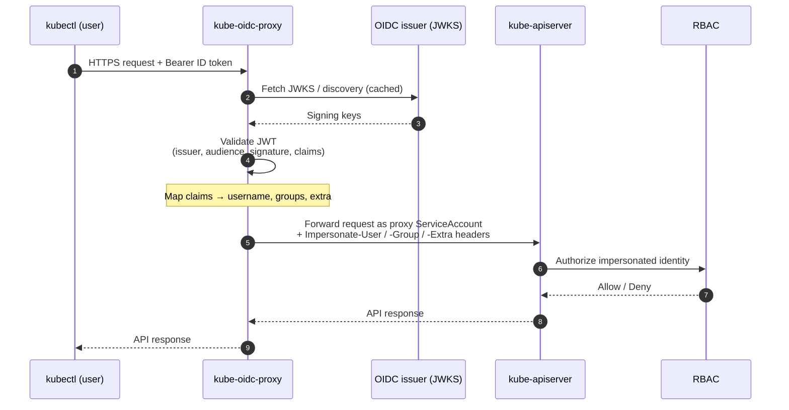

# 🔐 kube-oidc-proxy

🔐 **kube-oidc-proxy**: A reverse proxy that authenticates users with OpenID Connect (OIDC) and impersonates them against the Kubernetes API server — bringing OIDC login to managed clusters (EKS, GKE, AKS, …) where you can't set the API server's OIDC flags.

> [!NOTE]
> This is a fork of [`TremoloSecurity/kube-oidc-proxy`](https://github.com/TremoloSecurity/kube-oidc-proxy), which is itself a fork of the original [`jetstack/kube-oidc-proxy`](https://github.com/jetstack/kube-oidc-proxy). The headline addition in this fork is **multi-issuer authentication** via `--authentication-config`: a single proxy can accept tokens from several OIDC issuers at once. Optional serving-certificate integration still uses [`jetstack/cert-manager`](https://github.com/jetstack/cert-manager).

## 🔄 How It Works

The proxy sits in front of the API server. It validates the bearer token against one or more OIDC issuers, maps the token's claims to a Kubernetes identity, then forwards the request to the API server using its **own ServiceAccount** plus impersonation headers for the mapped user. The API server evaluates **RBAC** for that user as usual — so you get OIDC login without ever touching the API server's `--oidc-*` flags. Full detail in [docs/architecture.md](./docs/architecture.md).



## 🚀 Quickstart

Install with Helm — from the OCI registry or a local checkout of this repo:

```sh
# OCI registry (published by the release pipeline)
helm install kube-oidc-proxy oci://ghcr.io/rafpe/charts/kube-oidc-proxy \
  --namespace kube-oidc-proxy --create-namespace \
  --set oidc.clientId=<client-id> \
  --set oidc.issuerUrl=https://<issuer-url> \
  --set oidc.usernameClaim=email

# ...or from this checkout
helm install kube-oidc-proxy ./chart/kube-oidc-proxy \
  --namespace kube-oidc-proxy --create-namespace \
  --set oidc.clientId=<client-id> \
  --set oidc.issuerUrl=https://<issuer-url> \
  --set oidc.usernameClaim=email
```

> [!IMPORTANT]
> The image `ghcr.io/rafpe/kube-oidc-proxy:1.1.0` and OCI chart are the **intended** published artifacts; the release pipeline is still pending, so until it lands, install from a local checkout. See [docs/installation.md](./docs/installation.md).

Then point `kubectl` at the proxy instead of the API server, using the `oidc` auth provider:

```yaml
clusters:
  - cluster:
      certificate-authority: /path/to/proxy-ca.pem   # the proxy's serving CA
      server: https://<proxy-address>:443
    name: my-cluster
users:
  - name: my-oidc-user
    user:
      auth-provider:
        name: oidc
        config:
          client-id: <client-id>
          idp-issuer-url: https://<issuer-url>
          id-token: <id-token>
          refresh-token: <refresh-token>
```

Full deployment, TLS, and kubeconfig detail: [docs/installation.md](./docs/installation.md).

## 📝 Usage (at a glance)

The proxy has two **mutually exclusive** modes — configure exactly one.

**Single-issuer** (the classic `--oidc-*` flags):

```yaml
oidc:
  clientId: my-client
  issuerUrl: https://accounts.google.com
  usernameClaim: email
  groupsClaim: groups        # optional
```

→ full guide: [docs/usage.md](./docs/usage.md)

**Multi-issuer** (accept tokens from several issuers via a Kubernetes `AuthenticationConfiguration`):

```yaml
authenticationConfig:
  content: |
    apiVersion: apiserver.config.k8s.io/v1beta1
    kind: AuthenticationConfiguration
    jwt:
      - issuer:
          url: https://accounts.google.com
          audiences: [my-google-client]
        claimMappings:
          username: { claim: email, prefix: "google:" }
      - issuer:
          url: https://token.actions.githubusercontent.com
          audiences: [my-github-client]
        claimMappings:
          username: { claim: sub, prefix: "github:" }
```

→ full guide: [docs/tasks/multi-issuer.md](./docs/tasks/multi-issuer.md)

> [!WARNING]
> When `authenticationConfig.content` is set, the chart passes `--authentication-config` and **omits every `--oidc-*` flag**; the `oidc.*` values are ignored. Don't configure both modes at once.

## ✨ Features

- **Standards-based single-issuer OIDC** via the familiar `--oidc-*` flags (issuer, client ID, username/groups claims and prefixes, required claims, signing algorithms) — plain OIDC ID tokens, with flag parity with the API server's own OIDC authenticator.
- **Multi-issuer OIDC** via a Kubernetes `AuthenticationConfiguration` and a union authenticator — accept tokens from many providers at once.
- **Configurable readiness** for multi-issuer setups (`--readiness-require-all-issuers`): become ready on the first issuer, or wait for all.
- **Impersonation, not credential sharing** — the proxy impersonates the end user; RBAC stays authoritative. Supports `kubectl --as`, gated by `SubjectAccessReview`.
- **Token passthrough** for non-OIDC bearer tokens (`--token-passthrough`), validated via TokenReview.
- **Auditable** — every request logged to stdout; original identity recorded via `Extra` headers.
- **Hardened Helm chart** — self-signed / cert-manager / own-secret TLS, PodDisruptionBudget, topology spread, locked-down SecurityContext by default.

## 📚 Documentation

| Topic | Where |
| --- | --- |
| How it works, request flow, union authenticator, readiness | [docs/architecture.md](./docs/architecture.md) |
| Deployment options, TLS, kubeconfig | [docs/installation.md](./docs/installation.md) |
| Single- vs multi-issuer walkthrough | [docs/usage.md](./docs/usage.md) |
| Impersonation model & audit headers | [docs/impersonation.md](./docs/impersonation.md) |
| All proxy flags | [docs/cli-reference.md](./docs/cli-reference.md) |
| Troubleshooting & request logs | [docs/troubleshooting.md](./docs/troubleshooting.md) |
| Security considerations | [docs/security.md](./docs/security.md) |
| All chart values | [chart/kube-oidc-proxy/README.md](./chart/kube-oidc-proxy/README.md) |
| Multi-issuer OIDC | [docs/tasks/multi-issuer.md](./docs/tasks/multi-issuer.md) |
| Token passthrough | [docs/tasks/token-passthrough.md](./docs/tasks/token-passthrough.md) |
| No impersonation | [docs/tasks/no-impersonation.md](./docs/tasks/no-impersonation.md) |
| Extra impersonation headers | [docs/tasks/extra-impersonation-headers.md](./docs/tasks/extra-impersonation-headers.md) |
| Auditing | [docs/tasks/auditing.md](./docs/tasks/auditing.md) |
| Development & testing | [docs/tasks/development-testing.md](./docs/tasks/development-testing.md) |
| kind + GitHub Actions walkthrough | [docs/tasks/testing-kind-github-actions.md](./docs/tasks/testing-kind-github-actions.md) |
| Multi-issuer demo | [demo/README.md](./demo/README.md) |

## 🤝 Contributing

Contributions are welcome — issues and pull requests both. Building requires Go 1.17+. See the [development & testing guide](./docs/tasks/development-testing.md) for running the proxy from source and the hermetic `make e2e` end-to-end suite. To try the multi-issuer flow end to end, start with the [demo](./demo/README.md).
