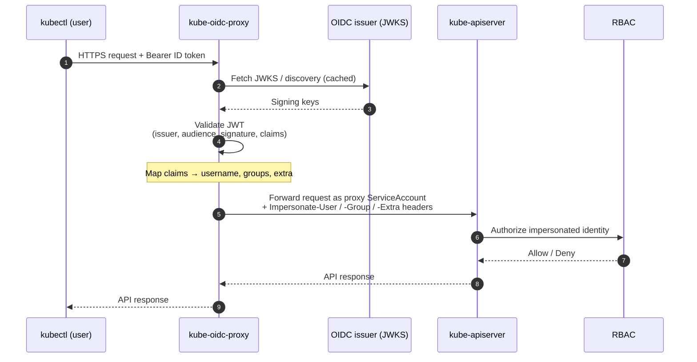

# 🔐 kube-oidc-proxy

🔐 **kube-oidc-proxy**: A reverse proxy that authenticates users with OpenID Connect (OIDC) and impersonates them against the Kubernetes API server — bringing OIDC login to managed clusters (EKS, GKE, AKS, …) where you can't set the API server's OIDC flags.

> [!NOTE]
> This is a fork of [`TremoloSecurity/kube-oidc-proxy`](https://github.com/TremoloSecurity/kube-oidc-proxy), which is itself a fork of the original [`jetstack/kube-oidc-proxy`](https://github.com/jetstack/kube-oidc-proxy). The headline addition in this fork is **multi-issuer authentication** via `--authentication-config`: a single proxy can accept tokens from several OIDC issuers at once. Optional serving-certificate integration still uses [`jetstack/cert-manager`](https://github.com/jetstack/cert-manager).

- [🔐 kube-oidc-proxy](#-kube-oidc-proxy)
  - [📋 Overview](#-overview)
    - [What kube-oidc-proxy Does](#what-kube-oidc-proxy-does)
    - [Why Do You Need kube-oidc-proxy](#why-do-you-need-kube-oidc-proxy)
    - [Key Benefits](#key-benefits)
  - [Features](#features)
  - [🔄 How It Works](#-how-it-works)
  - [📋 Prerequisites](#-prerequisites)
  - [📦 Deployment](#-deployment)
    - [1. 📦 Install from the OCI registry](#1--install-from-the-oci-registry)
    - [2. 🧑‍💻 Install from a local checkout](#2--install-from-a-local-checkout)
    - [3. 📄 Render raw manifests](#3--render-raw-manifests)
    - [🔑 Point kubectl at the proxy](#-point-kubectl-at-the-proxy)
  - [📝 Usage](#-usage)
    - [Single-issuer configuration](#single-issuer-configuration)
    - [Multi-issuer configuration](#multi-issuer-configuration)
    - [🎛️ Key chart values](#️-key-chart-values)
    - [🎭 The impersonation model](#-the-impersonation-model)
    - [📊 Request logging](#-request-logging)
  - [⌘ Commandline Options](#-commandline-options)
  - [🔧 Troubleshooting](#-troubleshooting)
  - [🛡️ Security Considerations](#️-security-considerations)
  - [🤝 Contributing](#-contributing)

## 📋 Overview

### What kube-oidc-proxy Does

`kube-oidc-proxy` is a reverse proxy that sits in front of a Kubernetes API server. It takes ordinary `kubectl` (or any Kubernetes client) requests, **authenticates the bearer token against one or more OIDC issuers**, and then forwards the request to the API server using [impersonation](https://kubernetes.io/docs/reference/access-authn-authz/authentication/#user-impersonation) headers derived from the token's claims. The API server sees the request as the mapped user; RBAC is evaluated for that user as usual.

Because the proxy performs authentication itself, you get OIDC login **without touching the API server's `--oidc-*` flags** — exactly the knobs you can't reach on a managed control plane.

### Why Do You Need kube-oidc-proxy

Managed Kubernetes providers (EKS, GKE, AKS, and most others) don't let you configure the API server's OIDC authenticator. That leaves you stuck with provider-specific IAM, static tokens, or client certificates when what you actually want is "log in with our company IdP."

`kube-oidc-proxy` closes that gap: deploy it in the cluster, front the API server with it, and hand users an OIDC-backed kubeconfig. This fork goes one step further and lets a single proxy trust **several issuers simultaneously** — e.g. your corporate IdP *and* GitHub Actions' OIDC issuer for CI — via a Kubernetes `AuthenticationConfiguration`.

### Key Benefits

- **Works on managed clusters** — no access to API-server flags required.
- **Multi-issuer** — accept tokens from many OIDC providers at once (`--authentication-config`), with a union authenticator.
- **Standards-based** — plain OIDC ID tokens; flag parity with the API server's own OIDC authenticator.
- **Impersonation, not credential sharing** — the proxy uses its own ServiceAccount and impersonates the end user; RBAC stays authoritative.
- **Auditable** — every request is logged to stdout (SIEM-friendly), and the original identity is recorded in the API server's audit log via `Extra` headers.
- **Hardened Helm chart** — self-signed or cert-manager TLS, PodDisruptionBudget, topology spread, and a locked-down SecurityContext by default.

## Features

- Single-issuer OIDC via the familiar `--oidc-*` flags (issuer URL, client ID, username/groups claims and prefixes, required claims, signing algorithms).
- **Multi-issuer** OIDC via a Kubernetes `AuthenticationConfiguration` (`apiserver.config.k8s.io/v1` or `v1beta1`) passed with `--authentication-config`.
- Configurable readiness semantics for multi-issuer setups (`--readiness-require-all-issuers`): become ready on the first issuer, or wait for all.
- End-user impersonation passthrough — supports `kubectl --as`, gated by `SubjectAccessReview`.
- Token passthrough for non-OIDC bearer tokens (`--token-passthrough`), validated via TokenReview.
- Extra impersonation headers, including the client source IP.
- Secure serving with your own TLS secret, a chart-generated self-signed cert, or cert-manager.

## 🔄 How It Works

1. A client (`kubectl`) sends a request to `kube-oidc-proxy` over HTTPS, carrying an OIDC **ID token** as a bearer token.
2. The proxy validates the JWT against the configured issuer(s): it fetches and caches each issuer's JWKS, then verifies the signature, issuer, audience, expiry, and any required claims.
3. On success, the proxy maps the token's claims to a Kubernetes identity — username, groups, and extra info — applying any configured prefixes.
4. The proxy forwards the original request to the **kube-apiserver**, authenticating with its **own ServiceAccount** and attaching `Impersonate-User` / `Impersonate-Group` / `Impersonate-Extra-*` headers for the mapped identity.
5. The API server evaluates **RBAC** for the impersonated identity and returns the response, which the proxy passes back to the client.



> [!NOTE]
> Because the proxy relies on impersonation to forward authenticated requests, impersonation from user requests (`kubectl --as`) is only honoured after the proxy has authorized it via `SubjectAccessReview`. See [The impersonation model](#-the-impersonation-model).

## 📋 Prerequisites

- A Kubernetes cluster and `kubectl`.
- [Helm](https://helm.sh) 3+ (the chart is developed and tested against Helm v4).
- One or more OIDC issuers that publish a discovery document and JWKS.
- Optionally, [cert-manager](https://github.com/jetstack/cert-manager) if you want it to issue the proxy's serving certificate.

## 📦 Deployment

The recommended way to deploy is the Helm chart in [`./chart/kube-oidc-proxy`](./chart/kube-oidc-proxy). It creates the Deployment, Service, ServiceAccount, and impersonation RBAC in a `kube-oidc-proxy` namespace. See the [chart README](./chart/kube-oidc-proxy/README.md) for the full values reference.

> [!IMPORTANT]
> The container image `ghcr.io/rafpe/kube-oidc-proxy:1.1.0` and the OCI chart `oci://ghcr.io/rafpe/charts/kube-oidc-proxy` are the **intended** published artifacts. The release pipeline is still pending, so they may not be pushed yet — until then, install from a local checkout (option 2).

### 1. 📦 Install from the OCI registry

```sh
helm install kube-oidc-proxy \
  oci://ghcr.io/rafpe/charts/kube-oidc-proxy \
  --namespace kube-oidc-proxy --create-namespace \
  --set oidc.clientId=<client-id> \           # 👈 your OIDC client ID
  --set oidc.issuerUrl=https://<issuer-url> \  # 👈 your OIDC issuer
  --set oidc.usernameClaim=email               # 👈 claim used as the username
```

### 2. 🧑‍💻 Install from a local checkout

```sh
helm install kube-oidc-proxy ./chart/kube-oidc-proxy \
  --namespace kube-oidc-proxy --create-namespace \
  --set oidc.clientId=<client-id> \
  --set oidc.issuerUrl=https://<issuer-url> \
  --set oidc.usernameClaim=email
```

### 3. 📄 Render raw manifests

Prefer plain YAML for `kubectl apply` or GitOps? Render it from the chart instead of maintaining a separate copy:

```sh
helm template kube-oidc-proxy ./chart/kube-oidc-proxy \
  --namespace kube-oidc-proxy -f my-values.yaml > kube-oidc-proxy.yaml
kubectl apply -f kube-oidc-proxy.yaml
```

### 🔑 Point kubectl at the proxy

Once the proxy Service has an address, hand users a kubeconfig that talks to `kube-oidc-proxy` instead of the API server directly, using the `oidc` auth provider:

```yaml
apiVersion: v1
clusters:
  - cluster:
      certificate-authority: /path/to/proxy-ca.pem  # 👈 the proxy's serving CA
      server: https://<proxy-address>:443
    name: my-cluster
contexts:
  - context:
      cluster: my-cluster
      user: my-oidc-user
    name: my-cluster
current-context: my-cluster
kind: Config
users:
  - name: my-oidc-user
    user:
      auth-provider:
        name: oidc
        config:
          client-id: <client-id>
          client-secret: <client-secret>
          idp-issuer-url: https://<issuer-url>
          id-token: <id-token>
          refresh-token: <refresh-token>
```

> [!TIP]
> [OpenUnison](https://openunison.github.io/) integrates `kube-oidc-proxy` directly and bundles an identity provider and access portal — a fast way to get an end-to-end login flow if you don't already have an OIDC IdP wired up.

## 📝 Usage

The proxy has two **mutually exclusive** authentication modes. Choose exactly one:

| Mode | How to enable | Flags used |
| --- | --- | --- |
| **Single-issuer** | Set `oidc.clientId`, `oidc.issuerUrl`, `oidc.usernameClaim` | `--oidc-*` |
| **Multi-issuer** | Set `authenticationConfig.content` | `--authentication-config` |

> [!WARNING]
> When `authenticationConfig.content` is non-empty the chart passes `--authentication-config` and **omits every `--oidc-*` flag**; the `oidc.*` values are ignored. Don't configure both modes at once — the proxy rejects it (`authentication-config and --oidc-* flags are mutually exclusive`).

### Single-issuer configuration

```yaml
oidc:
  clientId: my-client
  issuerUrl: https://accounts.google.com
  usernameClaim: email
  groupsClaim: groups          # 👈 optional: claim carrying the user's groups
  requiredClaims:              # 👈 optional: claims that MUST match
    hd: example.com
```

If the issuer presents a certificate from a private CA, supply it inline so the proxy can verify the TLS connection:

```yaml
oidc:
  clientId: my-client
  issuerUrl: https://oidc.internal.example.com
  usernameClaim: email
  caPEM: |
    -----BEGIN CERTIFICATE-----
    ...
    -----END CERTIFICATE-----
```

### Multi-issuer configuration

Accept tokens from several identity providers by supplying a Kubernetes `AuthenticationConfiguration` under `authenticationConfig.content`. Each issuer's CA (if any) must be inline under `issuer.certificateAuthority`.

```yaml
# All oidc.* fields are ignored while this is set.
readinessRequireAllIssuers: true   # 👈 wait for EVERY issuer before Ready (see note)
authenticationConfig:
  content: |
    apiVersion: apiserver.config.k8s.io/v1beta1
    kind: AuthenticationConfiguration
    jwt:
      - issuer:
          url: https://accounts.google.com
          audiences:
            - my-google-client
        claimMappings:
          username:
            claim: email
            prefix: "google:"       # 👈 prefix avoids username clashes across issuers
      - issuer:
          url: https://token.actions.githubusercontent.com
          audiences:
            - my-github-client
        claimMappings:
          username:
            claim: sub
            prefix: "github:"
```

> [!NOTE]
> `readinessRequireAllIssuers` controls readiness semantics only:
> - **`false` (default)** — the pod is Ready as soon as **at least one** issuer initializes (JWKS fetched). A single IdP outage can't block a rollout for every other system; still-pending issuers keep initializing in the background.
> - **`true`** — the pod is Ready only once **every** issuer has initialized.
>
> Configuration errors always fail startup, regardless of this flag.

A complete, CI-tested multi-issuer example lives at [`./chart/kube-oidc-proxy/ci/multi-issuer-values.yaml`](./chart/kube-oidc-proxy/ci/multi-issuer-values.yaml), and the [multi-issuer task doc](./docs/tasks/multi-issuer.md) walks through it end to end.

### 🎛️ Key chart values

A frequently used subset — see the [chart README](./chart/kube-oidc-proxy/README.md) for the complete table.

| Key | Type | Default | Description |
| --- | --- | --- | --- |
| `replicaCount` | int | `1` | Number of proxy replicas. |
| `image.repository` | string | `ghcr.io/rafpe/kube-oidc-proxy` | Container image repository. |
| `image.tag` | string | `"1.1.0"` | Image tag (pin an explicit version; never `latest`). |
| `oidc.clientId` | string | `""` | **Single-issuer**: OIDC client ID. Ignored in multi-issuer mode. |
| `oidc.issuerUrl` | string | `""` | **Single-issuer**: OIDC issuer URL. Ignored in multi-issuer mode. |
| `oidc.usernameClaim` | string | `""` | **Single-issuer**: token claim used as the username. Ignored in multi-issuer mode. |
| `oidc.groupsClaim` | string | `nil` | **Single-issuer**: token claim carrying groups. |
| `oidc.requiredClaims` | map | `{}` | **Single-issuer**: claims that must equal a value (repeatable `--oidc-required-claim`). |
| `oidc.caPEM` | string | `nil` | **Single-issuer**: PEM CA verifying the issuer's TLS. |
| `authenticationConfig.content` | string | `""` | **Multi-issuer**: YAML of an `AuthenticationConfiguration`. Enables `--authentication-config`. |
| `readinessRequireAllIssuers` | bool | `false` | **Multi-issuer**: require every issuer to initialize before Ready. |
| `tokenPassthrough.enabled` | bool | `false` | Forward non-OIDC bearer tokens to the API server (TokenReview). |
| `extraImpersonationHeaders.clientIP` | bool | `false` | Send the client source IP as an extra user header. |
| `tls.secretName` | string | `nil` | Existing `kubernetes.io/tls` Secret; if unset, a self-signed cert is generated. |
| `tls.certManager` | bool | `false` | Let cert-manager issue the serving certificate. |
| `podDisruptionBudget.enabled` | bool | `false` | Create a PodDisruptionBudget (recommended with `replicaCount` > 1). |
| `extraArgs` | map | `{}` | Arbitrary extra proxy flags passed as `--key=value`. |

### 🎭 The impersonation model

`kube-oidc-proxy` supports impersonation headers on inbound requests, so `kubectl --as` works through the proxy. When a request carries impersonation headers, the proxy first checks — via `SubjectAccessReview` against the API server — that the authenticated user is allowed to assume that identity. Once authorized, the proxy forwards the impersonated identity instead of the caller's own.

Whenever the proxy impersonates, it also attaches `Extra` headers identifying the **original** authenticated user, so the API server's audit log records who really made the request:

| Extra key | When it is sent | Description |
| --- | --- | --- |
| `originaluser.jetstack.io-user` | Always (when impersonating) | The original username. |
| `originaluser.jetstack.io-groups` | When the original user has ≥1 group | The original groups. |
| `originaluser.jetstack.io-uid` | When the original user has a UID | The original user UID. |
| `originaluser.jetstack.io-extra` | When the original identity carries extra info | A JSON-encoded map of arrays with all the original `extra` fields. |

> [!IMPORTANT]
> The `originaluser.jetstack.io-*` keys are a runtime API contract and are intentionally left unchanged from upstream. When you use `Impersonate-Extra-` headers, the proxy's ServiceAccount must be explicitly authorized via RBAC to impersonate that extra key — extras are treated as subresources that require explicit authorization.

### 📊 Request logging

Beyond auditing, the proxy logs every request to stdout so a SIEM (via fluentd or similar) can ingest them. A successful authentication looks like:

```
[2021-11-25T01:05:17+0000] AuSuccess src:[10.42.0.5 / 10.42.1.3, 10.42.0.5] URI:/api/v1/namespaces/openunison/pods?limit=500 inbound:[mlbadmin1 / system:masters|system:authenticated /]
```

- The bracketed prefix is an ISO-8601 timestamp.
- `AuSuccess` indicates authentication succeeded (`AuFail` on failure).
- `src` is the remote address, followed by the `X-Forwarded-For` value if present.
- `URI` is the request path.
- `inbound` is the username, groups, and extra info taken from the JWT.

When impersonation headers are present, an `outbound` section is appended showing the impersonated identity:

```
[2021-11-25T01:05:17+0000] AuSuccess src:[10.42.0.5 / 10.42.1.3] URI:/api/v1/namespaces/openunison/pods?limit=500 inbound:[mlbadmin1 / system:masters|system:authenticated /] outbound:[mlbadmin2 / group2|system:authenticated /]
```

A failure omits the token information:

```
[2021-11-25T01:05:24+0000] AuFail src:[10.42.0.5 / 10.42.1.3] URI:/api/v1/nodes
```

## ⌘ Commandline Options

The proxy binary is `kube-oidc-proxy`. The chart wires these flags from values, but you can pass any of them directly (or via `extraArgs`). The most relevant flags, read from [`cmd/app/options/`](./cmd/app/options/):

**Multi-issuer authentication**

| Flag | Default | Description |
| --- | --- | --- |
| `--authentication-config` | — | Path to an `AuthenticationConfiguration` (`apiserver.config.k8s.io/v1` or `v1beta1`) enabling multi-issuer OIDC. Mutually exclusive with the `--oidc-*` flags. |
| `--readiness-require-all-issuers` | `false` | Report ready only once **every** issuer has initialized (JWKS fetched). Default: ready after the first issuer; others keep initializing in the background. |

**Single-issuer OIDC** (all ignored when `--authentication-config` is set)

| Flag | Default | Description |
| --- | --- | --- |
| `--oidc-issuer-url` | — | URL of the OpenID issuer (HTTPS only). |
| `--oidc-client-id` | — | Client ID expected in the token audience. |
| `--oidc-ca-file` | — | CA that verifies the issuer's TLS; falls back to the host root CAs. |
| `--oidc-username-claim` | `sub` | Token claim used as the username. |
| `--oidc-username-prefix` | — | Prefix prepended to usernames (`-` to disable prefixing). |
| `--oidc-groups-claim` | — | Token claim carrying the user's groups. |
| `--oidc-groups-prefix` | — | Prefix prepended to group names. |
| `--oidc-signing-algs` | `RS256` | Comma-separated allowed JOSE signing algorithms. |
| `--oidc-required-claim` | — | Repeatable `key=value` claim that must be present with a matching value. |

**Token passthrough & impersonation**

| Flag | Default | Description |
| --- | --- | --- |
| `--token-passthrough` | `false` | (Alpha) Bearer tokens that fail OIDC validation are tried via TokenReview and, if valid, forwarded as-is with no impersonation. |
| `--token-passthrough-audiences` | — | (Alpha) Allowed audiences for passthrough tokens. |
| `--disable-impersonation` | `false` | (Alpha) Forward authenticated requests as-is, without impersonation. |
| `--extra-user-header-client-ip` | `false` | (Alpha) Add `Impersonate-Extra-Remote-Client-IP` with the request's remote address. |
| `--extra-user-headers` | — | (Alpha) Extra `key=value` user headers to add to the impersonated request. |

**Serving / TLS & misc**

| Flag | Default | Description |
| --- | --- | --- |
| `--secure-port` | `6443` | Port to serve HTTPS on. **The chart overrides this to `8443`** (readiness on `8080`, Service `443` → `8443`). |
| `--tls-cert-file` / `--tls-private-key-file` | — | Serving certificate and key. |
| `--bind-address` | `0.0.0.0` | Address to serve on. |
| `--readiness-probe-port` / `-P` | `8080` | Port exposing the `/ready` readiness probe. |
| `--flush-interval` | `50ms` | Interval to flush request bodies (streaming requests flush immediately). |
| `--kube-client-qps` / `--kube-client-burst` | — | Throttling for the proxy's own API-server client. |
| `--version` | — | Print version information and exit. |

More configuration guides:

- [Multi-issuer OIDC authentication](./docs/tasks/multi-issuer.md)
- [Token Passthrough](./docs/tasks/token-passthrough.md)
- [No Impersonation](./docs/tasks/no-impersonation.md)
- [Extra Impersonation Headers](./docs/tasks/extra-impersonation-headers.md)
- [Auditing](./docs/tasks/auditing.md)

## 🔧 Troubleshooting

| Symptom | Likely cause / fix |
| --- | --- |
| Pod never becomes Ready in multi-issuer mode | With `readinessRequireAllIssuers: true`, **all** issuers must fetch their JWKS. Check pod logs for the per-issuer initialization messages and confirm each issuer URL is reachable and serves a valid discovery/JWKS document. Set it to `false` to become ready on the first issuer. |
| `authentication-config and --oidc-* flags are mutually exclusive` | You set both `authenticationConfig.content` and one or more `oidc.*` values. Pick one mode. |
| `401 Unauthorized` from the proxy | The token failed OIDC validation — wrong `issuerUrl`/`clientId` (audience), expired token, unmet `requiredClaims`, or a signing algorithm not in `--oidc-signing-algs`. Look for an `AuFail` line in the proxy logs. |
| `403 Forbidden` after a successful login | Authentication worked but RBAC denied the impersonated identity. Grant the mapped username/groups the appropriate roles. Watch for username **prefixes** (e.g. `google:alice@example.com`). |
| `kubectl --as` fails through the proxy | The authenticated user isn't authorized to impersonate that identity (`SubjectAccessReview` denied), or the proxy's ServiceAccount lacks impersonation RBAC for a named `Impersonate-Extra-` key. |
| TLS errors connecting to the proxy | The client's kubeconfig `certificate-authority` must trust the proxy's **serving** certificate (self-signed by the chart, your own Secret, or cert-manager). |
| Confirm which issuers loaded | `kubectl -n kube-oidc-proxy logs deploy/kube-oidc-proxy \| grep "configured OIDC issuers"`. |

## 🛡️ Security Considerations

- **The proxy is a privileged component.** Its ServiceAccount can impersonate users, groups, and extras against the API server. Restrict who can modify its Deployment and RBAC, and run it with the hardened defaults the chart ships (non-root, read-only root filesystem, dropped capabilities, seccomp `RuntimeDefault`).
- **Impersonation replaces, but does not bypass, RBAC.** The API server still authorizes the impersonated identity. Keep API-server RBAC tight; the proxy only decides *who* the request is, not *what* they may do.
- **Terminate and verify TLS end to end.** Clients must trust the proxy's serving certificate, and each OIDC issuer's TLS must be verifiable (`oidc.caPEM` / inline `certificateAuthority` for private CAs).
- **Scope audiences and required claims.** Use `audiences` / `--oidc-client-id` and `requiredClaims` to ensure tokens minted for other systems can't be replayed against the cluster — especially important for machine issuers like GitHub Actions.
- **Mind username prefixes across issuers.** In multi-issuer mode, distinct `prefix` values prevent one issuer's `alice` from colliding with another's.
- **Use token passthrough deliberately.** `--token-passthrough` forwards non-OIDC tokens after a TokenReview; only enable it (and constrain `--token-passthrough-audiences`) when you understand the tokens involved.

## 🤝 Contributing

Contributions are welcome — issues and pull requests both.

> [!NOTE]
> Building `kube-oidc-proxy` requires Go 1.17 or higher.

There's a suite of tools for running a functioning proxy from source locally; see the [development & testing guide](./docs/tasks/development-testing.md). To try the multi-issuer flow end to end on a local kind cluster, see the [demo](./demo/README.md) and the [kind + GitHub Actions walkthrough](./docs/tasks/testing-kind-github-actions.md).

**End-to-end tests.** `make e2e` runs the Go end-to-end suite (`test/e2e/suite`) against a real Kubernetes cluster. It's hermetic: it builds the proxy and test-tool images from source, creates its own [kind](https://kind.sigs.k8s.io) cluster, loads the images, runs the suite, and tears the cluster down again on exit (including on failure or interrupt). No pre-existing cluster is required.

Prerequisites (all on `PATH`): `go`, `docker` (daemon running), `kind`, `kubectl`. Images are built for the host architecture, so the suite runs on both `amd64` and `arm64` (e.g. Apple Silicon).

```sh
make e2e          # build images, spin up kind, run the suite, tear down
make e2e-clean    # delete a leftover e2e kind cluster (safe if none exists)
```

Useful overrides: `E2E_TIMEOUT` (Go test timeout, default `30m`) and `KUBE_OIDC_PROXY_K8S_VERSION` (kind node image version).

The suite runs in CI on every pull request and on pushes to `main` (`.github/workflows/e2e.yaml`). A companion workflow (`.github/workflows/e2e-oidc-gha.yaml`) additionally proves the multi-issuer union authenticator against the **real** GitHub Actions OIDC issuer alongside a local Dex issuer.
</content>
</invoke>
