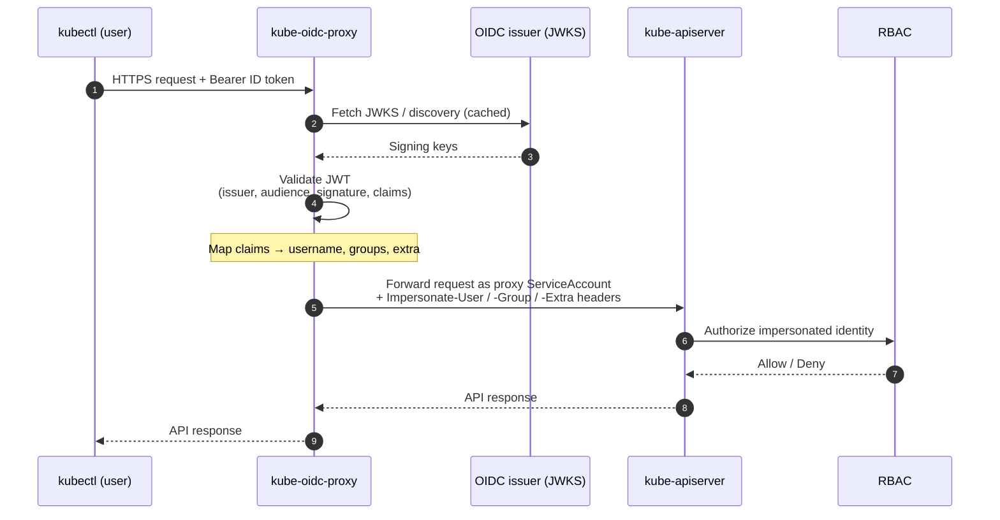
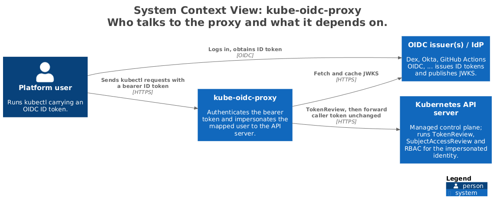
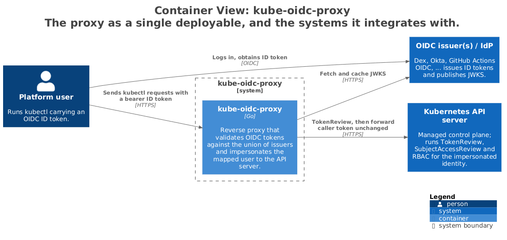

# Architecture

`kube-oidc-proxy` is a reverse proxy that sits in front of a Kubernetes API
server. It authenticates the bearer token on each request against one or more
OIDC issuers, then forwards the request to the API server using
[impersonation](https://kubernetes.io/docs/reference/access-authn-authz/authentication/#user-impersonation)
headers derived from the token's claims. The API server sees the request as the
mapped user; RBAC is evaluated for that user as usual.

Because the proxy performs authentication itself, you get OIDC login **without
touching the API server's `--oidc-*` flags** — exactly the knobs you can't reach
on a managed control plane (EKS, GKE, AKS, ...).

- [Request flow](#request-flow)
- [The auth → impersonate handler chain](#the-auth--impersonate-handler-chain)
- [Multi-issuer union authenticator](#multi-issuer-union-authenticator)
- [Readiness semantics](#readiness-semantics)
- [Diagrams](#diagrams)
  - [System context (C4 level 1)](#system-context-c4-level-1)
  - [Containers (C4 level 2)](#containers-c4-level-2)
  - [Handler-chain components (C4 level 3)](#handler-chain-components-c4-level-3)
- [See also](#see-also)

## Request flow

1. A client (`kubectl`) sends a request over HTTPS, carrying an OIDC **ID
   token** as a bearer token.
2. The proxy validates the JWT against the configured issuer(s): it fetches and
   caches each issuer's JWKS, then verifies the signature, issuer, audience,
   expiry, and any required claims.
3. On success, the proxy maps the token's claims to a Kubernetes identity —
   username, groups, and extra info — applying any configured prefixes.
4. The proxy forwards the original request to the **kube-apiserver**,
   authenticating with its **own ServiceAccount** and attaching
   `Impersonate-User` / `Impersonate-Group` / `Impersonate-Extra-*` headers for
   the mapped identity.
5. The API server evaluates **RBAC** for the impersonated identity and returns
   the response, which the proxy passes back to the client.

## The auth → impersonate handler chain

Every request passes through the same pipeline:

1. **Authenticate.** The bearer token is validated. If it fails OIDC validation
   and token passthrough is enabled, the proxy falls back to a `TokenReview`
   against the API server (see [token passthrough](./authentication.md#token-passthrough)).
   Review results are served from a bounded in-memory cache — see
   [Caching and API-server protection](./caching.md#tokenreview-result-cache).
2. **Resolve the impersonation target.** If the inbound request also carries
   `Impersonate-*` headers (`kubectl --as`), the proxy runs a
   `SubjectAccessReview` to confirm the authenticated user may assume that
   identity before honouring it (see
   [the impersonation model](./authentication.md#impersonation-model)). The
   header value count is capped up front (over-cap requests are rejected with
   HTTP 431 before any review is sent), and decisions are served from a
   bounded in-memory cache — see
   [Caching and API-server protection](./caching.md#subjectaccessreview-decision-cache).
3. **Impersonate.** The proxy rewrites the request to authenticate as its own
   ServiceAccount, attaches the impersonation headers for the resolved identity,
   and records the original caller in `originaluser.jetstack.io-*` extra headers
   for the API server's audit log.
4. **Proxy.** The request is streamed to the API server and the response streamed
   back.

## Multi-issuer union authenticator

Single-issuer mode uses the familiar `--oidc-*` flags and trusts exactly one
issuer. Multi-issuer mode (`--authentication-config`) loads a Kubernetes
[`AuthenticationConfiguration`](./multi-issuer.md) that lists several JWT
issuers, each with its own audiences and claim mappings.

The proxy builds one authenticator per issuer and combines them into a **union
authenticator**: an incoming token is offered to each issuer's authenticator in
turn, and the first one that accepts it wins. This is what lets a single proxy
accept, for example, tokens from your corporate IdP **and** from GitHub Actions'
OIDC issuer at the same time. Per-issuer username/group **prefixes** keep
identities from different issuers from colliding.

The two modes are **mutually exclusive**. When `--authentication-config` is set,
issuer-specific `--oidc-*` flags are rejected. The optional OIDC TLS client
certificate/key pair is transport configuration shared by all issuers and is
therefore accepted in either mode.

## Readiness semantics

Each issuer must fetch its JWKS before it can validate tokens. By default the
pod is Ready as soon as at least one issuer has, so one identity provider's
outage cannot block a rollout for every other system; still-pending issuers
keep initializing in the background and their tokens fail with 401 until they
do. `--readiness-require-all-issuers` waits for every issuer instead.
Configuration errors always fail startup, regardless of the flag. The details,
the log records that show each issuer's state, and what happens when an issuer
goes away after startup are in
[multi-issuer: readiness](./multi-issuer.md#readiness) and
[operations: availability and issuer outages](./operations.md#availability-and-issuer-outages).

## Diagrams

These [C4 model](https://c4model.com/) views zoom in from the system in its
environment down to the request-handling components. For the runtime view of a
single request, see [Request flow](#request-flow) above.

The diagrams are generated from a Structurizr model; how to edit and
re-render them is in [development](./development.md#architecture-diagrams).

### System context (C4 level 1)

Who talks to the proxy and what it depends on: the user's `kubectl` presents an
ID token, the proxy verifies it against the external OIDC issuer(s), and then
impersonates the mapped user to the external Kubernetes API server.

### Containers (C4 level 2)

Inside the proxy: TLS is terminated by the serving layer, which drives the
handler chain. The authenticator validates the token against the union of
issuers; a token-passthrough fallback and the inbound-`--as` check both consult
the API server, and the readiness probe watches each issuer's JWKS
initialization through the authenticator.

### Handler-chain components (C4 level 3)

A structural view of the serving layer's handler chain, wrapped in execution
order authenticate then impersonate then audit then reverse proxy. Each stage
maps to a handler in `pkg/proxy`.

## See also

- [Multi-issuer authentication](./multi-issuer.md)
- [Getting started](./getting-started.md)
- [Configuration reference](./configuration.md)
- [Caching and API-server protection](./caching.md)
- [Operations: security](./operations.md#security)
