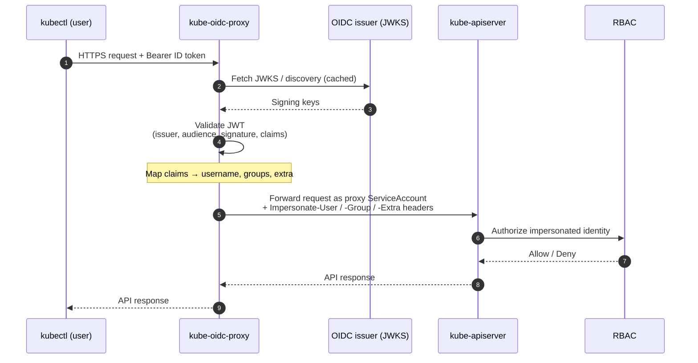
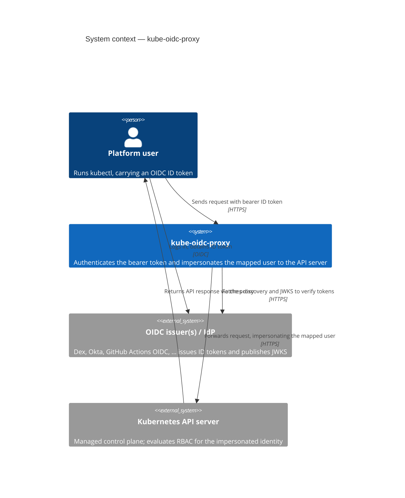
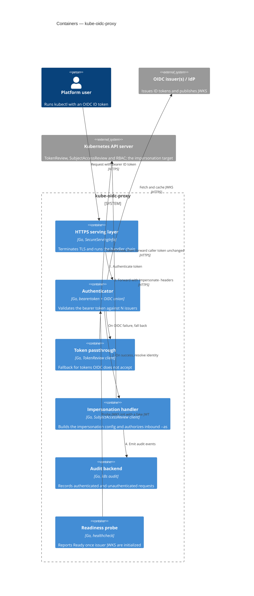
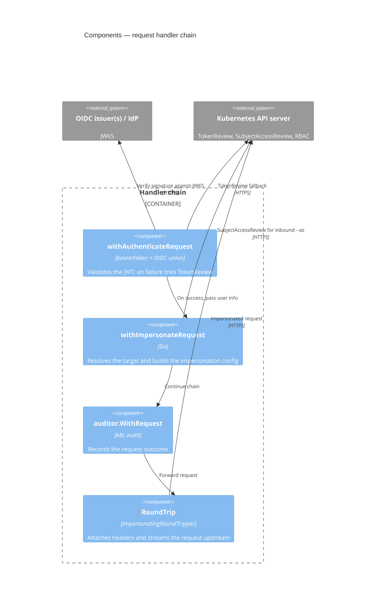

# Architecture

`kube-oidc-proxy` is a reverse proxy that sits in front of a Kubernetes API
server. It authenticates the bearer token on each request against one or more
OIDC issuers, then forwards the request to the API server using
[impersonation](https://kubernetes.io/docs/reference/access-authn-authz/authentication/#user-impersonation)
headers derived from the token's claims. The API server sees the request as the
mapped user; RBAC is evaluated for that user as usual.

Because the proxy performs authentication itself, you get OIDC login **without
touching the API server's `--oidc-*` flags** — exactly the knobs you can't reach
on a managed control plane (EKS, GKE, AKS, ...).

## Request flow

1. A client (`kubectl`) sends a request over HTTPS, carrying an OIDC **ID
   token** as a bearer token.
2. The proxy validates the JWT against the configured issuer(s): it fetches and
   caches each issuer's JWKS, then verifies the signature, issuer, audience,
   expiry, and any required claims.
3. On success, the proxy maps the token's claims to a Kubernetes identity —
   username, groups, and extra info — applying any configured prefixes.
4. The proxy forwards the original request to the **kube-apiserver**,
   authenticating with its **own ServiceAccount** and attaching
   `Impersonate-User` / `Impersonate-Group` / `Impersonate-Extra-*` headers for
   the mapped identity.
5. The API server evaluates **RBAC** for the impersonated identity and returns
   the response, which the proxy passes back to the client.

## The auth → impersonate handler chain

Every request passes through the same pipeline:

1. **Authenticate.** The bearer token is validated. If it fails OIDC validation
   and token passthrough is enabled, the proxy falls back to a `TokenReview`
   against the API server (see [token passthrough](./configuration.md#token-passthrough)).
2. **Resolve the impersonation target.** If the inbound request also carries
   `Impersonate-*` headers (`kubectl --as`), the proxy runs a
   `SubjectAccessReview` to confirm the authenticated user may assume that
   identity before honouring it. See [the impersonation model](./configuration.md#impersonation-model).
3. **Impersonate.** The proxy rewrites the request to authenticate as its own
   ServiceAccount, attaches the impersonation headers for the resolved identity,
   and records the original caller in `originaluser.jetstack.io-*` extra headers
   for the API server's audit log.
4. **Proxy.** The request is streamed to the API server and the response streamed
   back.

## Multi-issuer union authenticator

Single-issuer mode uses the familiar `--oidc-*` flags and trusts exactly one
issuer. Multi-issuer mode (`--authentication-config`) loads a Kubernetes
[`AuthenticationConfiguration`](./multi-issuer.md) that lists several JWT
issuers, each with its own audiences and claim mappings.

The proxy builds one authenticator per issuer and combines them into a **union
authenticator**: an incoming token is offered to each issuer's authenticator in
turn, and the first one that accepts it wins. This is what lets a single proxy
accept, for example, tokens from your corporate IdP **and** from GitHub Actions'
OIDC issuer at the same time. Per-issuer username/group **prefixes** keep
identities from different issuers from colliding.

The two modes are **mutually exclusive**. When `--authentication-config` is set,
every `--oidc-*` flag is rejected (`authentication-config and --oidc-* flags are
mutually exclusive`).

## Readiness semantics

In multi-issuer mode, each issuer must fetch its JWKS before it can validate
tokens. The `--readiness-require-all-issuers` flag
(`readinessRequireAllIssuers` in the chart) controls how readiness relates to
that initialization:

- **`false` (default)** — the pod is Ready as soon as **at least one** issuer
  initializes. A single IdP outage can't block a rollout for every other system;
  still-pending issuers keep initializing in the background.
- **`true`** — the pod is Ready only once **every** issuer has initialized.

Configuration errors always fail startup, regardless of this flag.

## Diagrams

These [C4 model](https://c4model.com/) views zoom in from the system in its
environment down to the request-handling components. For the runtime view of a
single request, see [Request flow](#request-flow) above.

### System context (C4 level 1)

Who talks to the proxy and what it depends on: the user's `kubectl` presents an
ID token, the proxy verifies it against the external OIDC issuer(s), and then
impersonates the mapped user to the external Kubernetes API server.

### Containers (C4 level 2)

Inside the proxy: TLS is terminated by the serving layer, which drives the
handler chain. The authenticator validates the token against the union of
issuers; a token-passthrough fallback and the inbound-`--as` check both consult
the API server, and the readiness probe watches each issuer's JWKS
initialization through the authenticator.

### Handler-chain components (C4 level 3)

A structural view of the serving layer's handler chain, wrapped in execution
order authenticate then impersonate then audit then reverse proxy. Each stage
maps to a handler in `pkg/proxy`.

## See also

- [Multi-issuer authentication](./multi-issuer.md)
- [Getting started](./getting-started.md)
- [Configuration reference](./configuration.md)
- [Operations: security](./operations.md#security)
