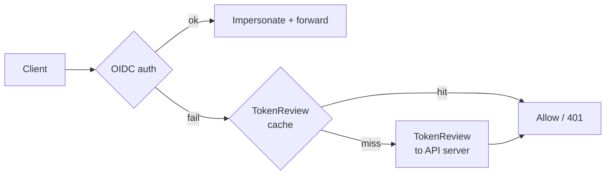
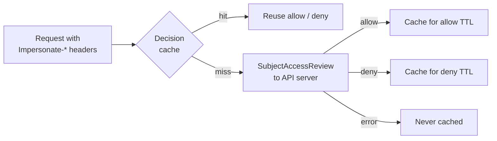
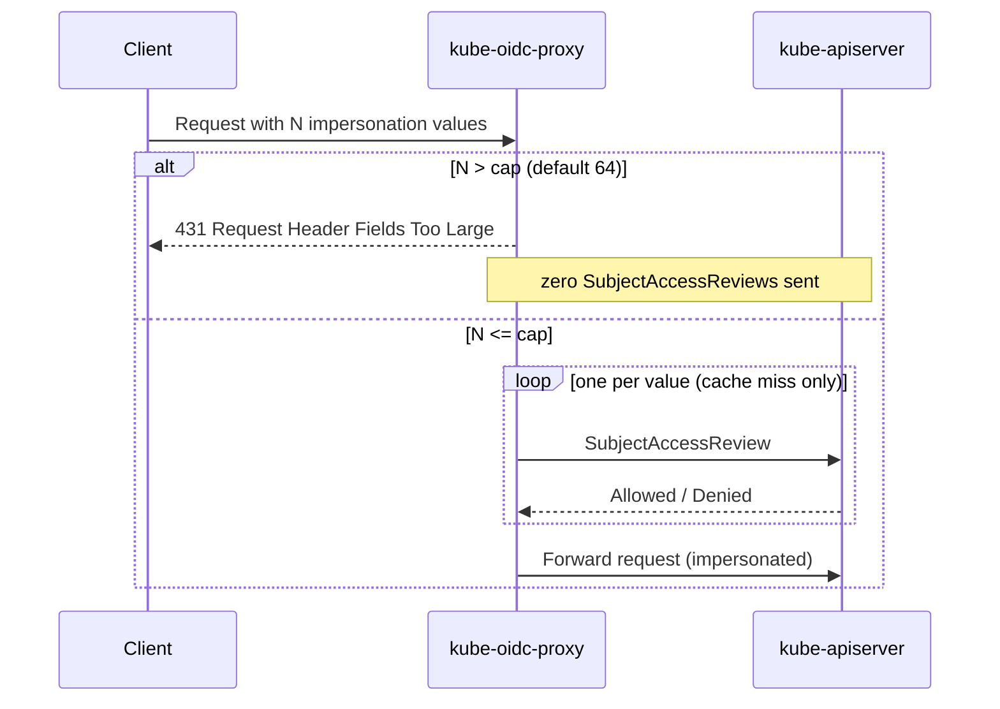

# Caching and API-server protection

Two request paths in the proxy turn client input into round trips to the
Kubernetes API server: validating a passthrough token costs a `TokenReview`,
and authorizing inbound impersonation (`kubectl --as`) costs one
`SubjectAccessReview` per impersonation header value. Left unbounded, both
scale with client behaviour — a request storm of invalid tokens, or a single
request stuffed with impersonation headers, becomes API-server load.

Three mechanisms bound that load:

| Mechanism | Flags | Defaults |
| --- | --- | --- |
| [TokenReview result cache](#tokenreview-result-cache) | `--token-passthrough-cache-success-ttl`, `--token-passthrough-cache-failure-ttl` | `10s` / `10s` |
| [SubjectAccessReview decision cache](#subjectaccessreview-decision-cache) | `--subject-access-review-cache-allow-ttl`, `--subject-access-review-cache-deny-ttl` | `10s` / `10s` |
| [Impersonation header value cap](#impersonation-header-value-cap) | `--max-impersonation-header-values` | `64` |

The caches follow the precedent set by `k8s.io/apiserver` for delegated
authentication and authorization: 10-second TTLs, definitive results only —
**errors are never cached** — and `0` disables. Both caches are bounded LRU
caches of at most **8192 entries**, so client-influenced input can never grow
the proxy's memory without bound.

## TokenReview result cache

Applies only with [`--token-passthrough`](./configuration.md#token-passthrough).
When a bearer token fails OIDC validation, the proxy falls back to a
`TokenReview` against the API server. Without a cache, every request carrying
the same failing token — for example during an OIDC issuer outage — becomes its
own API-server round trip. With it, repeated requests are answered from memory:

- **Split TTLs.** Successful reviews are cached for
  `--token-passthrough-cache-success-ttl`, unauthenticated results for
  `--token-passthrough-cache-failure-ttl`. Either can be `0` to disable that
  class; with both at `0` the reviewer runs exactly as if the cache did not
  exist.
- **Errors are never cached.** An unreachable API server or a timed-out review
  fails only the request that saw it and is retried on the next one — the path
  stays fail-closed.
- **Tokens are never stored as keys.** Cache keys are an HMAC-SHA256, keyed
  with a per-instance random key, over the token and configured audiences — so
  keys cannot be precomputed and a memory dump does not yield tokens.
- **Concurrent misses each run their own review — deliberately.** A miss runs
  on the caller's own context, so the full configured
  `--token-passthrough-request-timeout` applies and cancelling the request
  cancels its review. The cost is a few duplicate reviews when many requests
  present the same not-yet-cached token at the same instant; the first to
  finish populates the cache and everything after is a hit. The cache only
  ever subtracts load.

> [!WARNING]
> A cached success outlives token revocation: a token revoked at the API
> server keeps passing through the proxy for up to the success TTL. Keep it
> low (the `10s` default matches the kube-apiserver's own
> delegated-authentication cache) or set it to `0` if revocation must be
> per-request.

## SubjectAccessReview decision cache

When an inbound request carries `Impersonate-*` headers, the proxy verifies via
`SubjectAccessReview` that the authenticated user may assume each requested
value (see [inbound impersonation](./configuration.md#inbound-impersonation-kubectl---as)).
RBAC grants change rarely, so without a cache most of these calls ask the API
server the same question again and again:

- **Split TTLs, tuned per failure mode.** A cached **allow** means revoking an
  RBAC impersonation grant takes up to
  `--subject-access-review-cache-allow-ttl` to be enforced. A cached **deny**
  means a newly granted permission takes up to
  `--subject-access-review-cache-deny-ttl` to be honoured. Set either to `0`
  to re-check that class on every request; both at `0` disables the cache
  entirely.
- **The key is the whole question.** Each entry is keyed on the exact
  serialized `SubjectAccessReviewSpec` sent to the API server — requester
  username, groups, extras **and UID**, plus every resource attribute — so two
  distinct principals or questions can never share a decision.
- **Oversized questions are never cached.** Specs over 10 000 bytes (e.g.
  absurdly long header values) are authorized live and skipped by the cache, so
  a client cannot fill it with huge keys.
- **Concurrent identical misses share one review** (singleflight). If the
  shared call dies because another request was cancelled, waiters fall back to
  their own live check.
- **A hit behaves exactly like a live review.** Cached denials produce the
  identical error type, so `errors.Is` classification, `403` semantics, and
  fail-closed handling are unchanged.

## Impersonation header value cap

Each impersonation header value — the `Impersonate-User` value plus every
`Impersonate-Group`, `Impersonate-Uid`, and `Impersonate-Extra-*` value — costs
one `SubjectAccessReview`, and the count is entirely client-controlled. Values
are not deduplicated, and a single request can carry tens of thousands of them
before hitting HTTP header size limits — so a cap, not a cache, is the right
tool. The kube-apiserver tolerates unbounded counts because its per-value check
is in-process; here every value is a network call.

The proxy counts values **before** sending anything and rejects over-cap
requests with **HTTP 431 Request Header Fields Too Large**:

- Values are counted exactly the way the impersonation handler consumes them
  (case-insensitive `Impersonate-` prefix, every value of every key), so case
  variants or duplicate header keys cannot bypass the cap.
- At or under the cap, behaviour is byte-for-byte identical to having no cap:
  which identities are authorized, `403` handling, and auditing are unchanged.
- The cap must be greater than `0`. Raise it
  (`maxImpersonationHeaderValues` in the chart) only if identities legitimately
  carry more values; see [troubleshooting](./operations.md#troubleshooting) for
  the 431 symptom.

## Tuning

| You want | Set |
| --- | --- |
| Token revocation enforced per-request on the passthrough path | `--token-passthrough-cache-success-ttl=0` |
| A just-issued token accepted immediately after a failed attempt | `--token-passthrough-cache-failure-ttl=0` |
| RBAC impersonation revocation enforced per-request | `--subject-access-review-cache-allow-ttl=0` |
| New impersonation grants honoured immediately | `--subject-access-review-cache-deny-ttl=0` |
| Less API-server load from hot identities | Raise the TTLs — and accept the matching revocation/grant lag |
| Identities with more than 64 impersonation values | Raise `--max-impersonation-header-values` |

## See also

- [Configuration reference](./configuration.md) — the full flag tables.
- [Architecture](./architecture.md#the-auth--impersonate-handler-chain) — where
  these steps sit in the handler chain.
- [Operations: security](./operations.md#security) and
  [troubleshooting](./operations.md#troubleshooting) — symptoms of cache lag
  and the 431 rejection.
