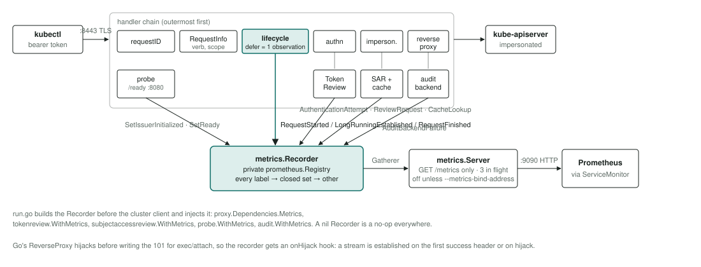
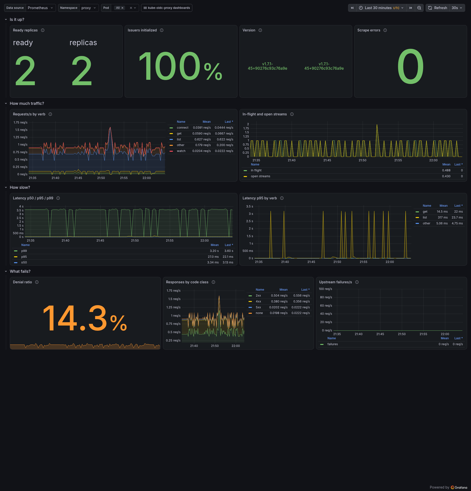
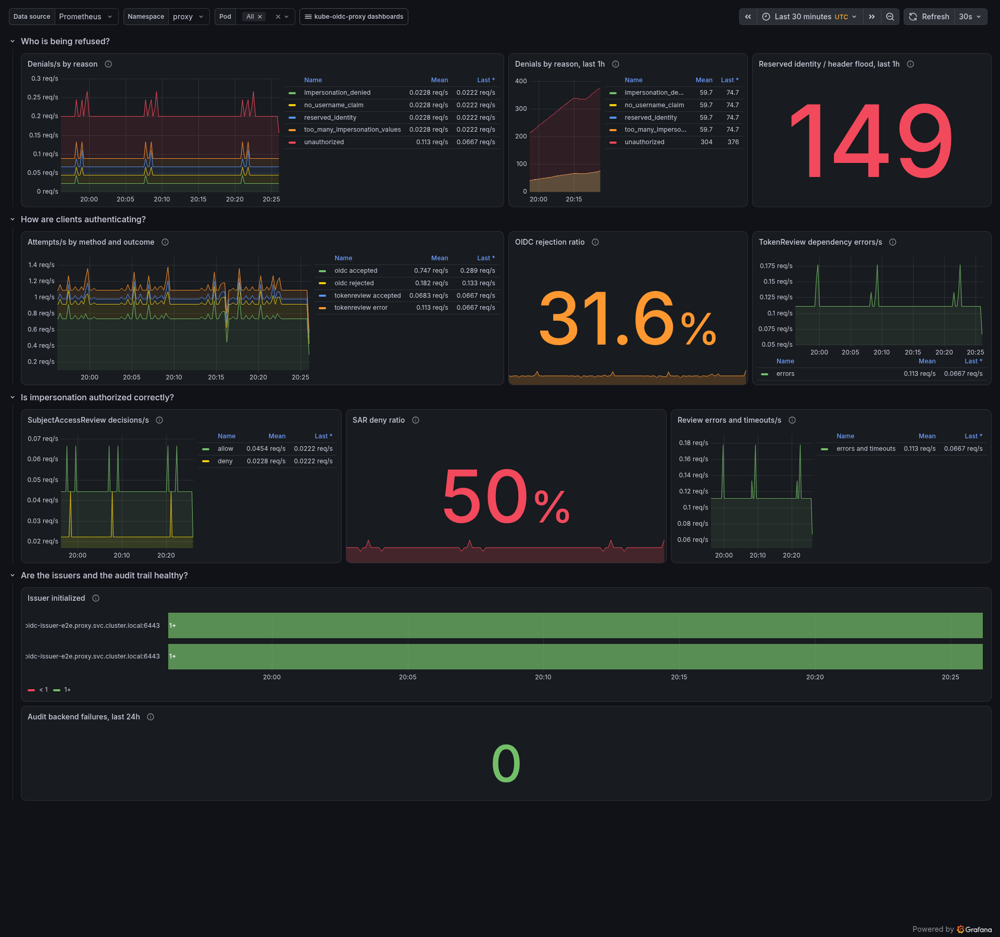
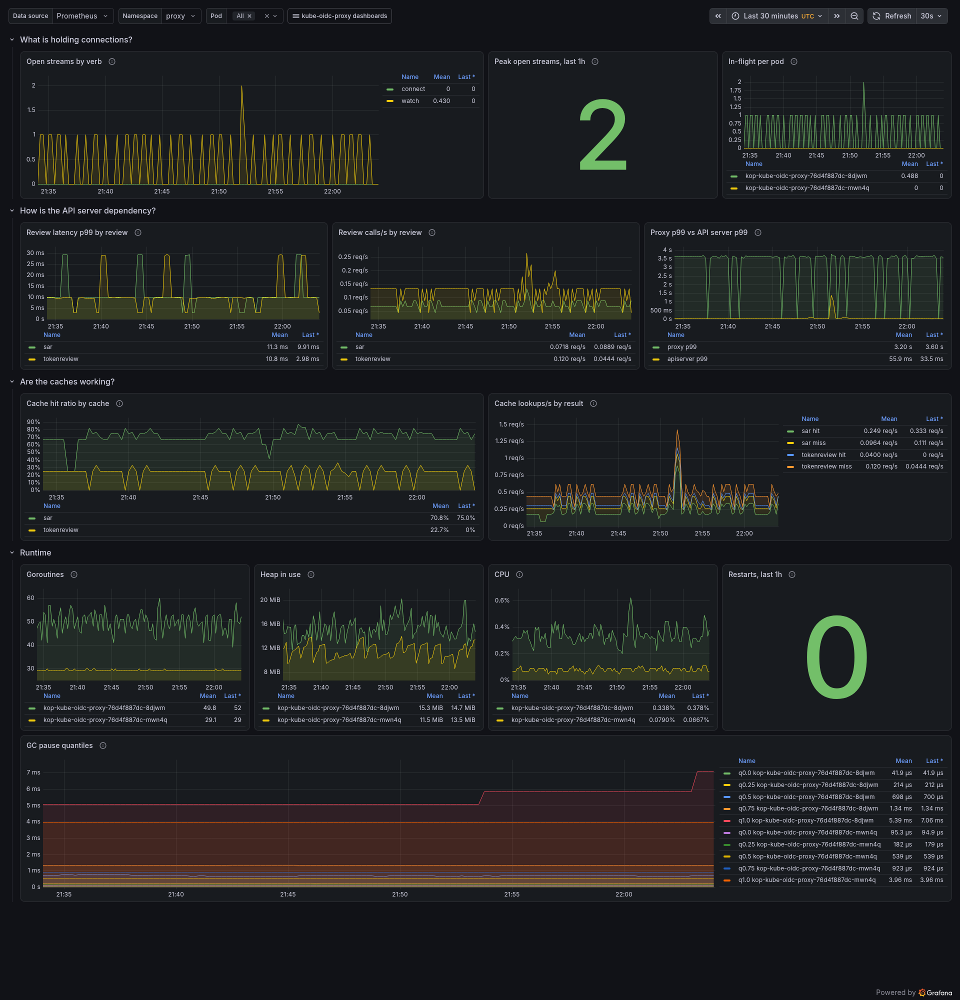

# Metrics

`kube-oidc-proxy` can serve Prometheus metrics on a dedicated listener. It is
**off by default**: pass `--metrics-bind-address=host:port` (or set
`metrics.enabled: true` in the chart) and the proxy answers `GET` and
`HEAD /metrics` on that address over plain HTTP. Nothing else is served there:
any other method on that path is `405` with an `Allow` header and every other
path is `404` — no pprof, no index, no reset.

- [What the endpoint reveals](#what-the-endpoint-reveals)
- [Where the metrics attach](#where-the-metrics-attach)
- [Catalogue](#catalogue)
- [Label values](#label-values)
- [Buckets](#buckets)
- [Compatibility](#compatibility)
- [Worked queries](#worked-queries)
- [Dashboards](#dashboards)
- [Exposure and hardening](#exposure-and-hardening)
- [See also](#see-also)

## What the endpoint reveals

Traffic shape and health, never who did what. No label ever carries a
username, group, UID, request id, request path, HTTP method, resource, API
group, issuer URL, peer address or User-Agent. Every label value is projected
onto a closed set before it reaches a collector, so a client cannot create a
series by sending an unusual request: an unknown verb, scope, status or reason
becomes `other`. That projection is a security control, the same class of
defence as the fix for CVE-2022-21698 (an unbounded `method` label in
promhttp). The "who" lives in the [audit log](./auditing.md), behind different
access controls.

The `go_*` and `process_*` families come from the Prometheus client library
and are documented by it; the proxy passes them through unchanged.

## Where the metrics attach



The whole request side is observed in one function: the deferred block of the
lifecycle filter (`pkg/proxy/lifecycle.go`), which already classifies status,
termination, hijack and panic once per request. The metric and the
`request.response.completed` record therefore carry the same values by
construction. Everything else reports through the same recorder, which is nil,
and a no-op, when metrics are off.

| Family | Observed at | Hook |
| --- | --- | --- |
| `requests_total`, `request_duration_seconds`, `requests_in_flight`, `long_running_requests` | the lifecycle filter's deferred block | `RequestStarted`, `LongRunningEstablished` (first success header, or hijack), `RequestFinished` |
| `authentication_attempts_total` | the authentication filter and the TokenReview fallback | `AuthenticationAttempt` |
| `access_decisions_total` | wherever the one access record is written | `AccessDecision`, through `recordDecision` |
| `review_requests_total`, `review_request_duration_seconds` | the single `Create` call of each review client | `ReviewRequest` |
| `cache_lookups_total` | the two review caches | `CacheLookup` |
| `oidc_issuer_initialized`, `ready` | the readiness probe's state transitions | `SetIssuerInitialized`, `SetReady` |
| `audit_backend_failures_total` | the audit backend's start and shutdown | `AuditBackendFailure` |

## Catalogue

Every first-party family, generated from the catalogue in `pkg/metrics`.
`make metricdoc` regenerates the table and CI fails on a diff. Stability is
also the prefix of each family's help string on the wire: `[STABLE]` families
keep their name, type and labels across releases; `[ALPHA]` families may
change with a changelog entry.

<!-- metrics:begin -->
| name | type | labels | stability | help |
|---|---|---|---|---|
| `kube_oidc_proxy_build_info` | gauge | `version`, `revision`, `go_version` | STABLE | Build information; always 1. |
| `kube_oidc_proxy_requests_total` | counter | `k8s_verb`, `scope`, `code`, `termination` | STABLE | Completed requests by Kubernetes verb, scope, HTTP status code and how the exchange ended. |
| `kube_oidc_proxy_request_duration_seconds` | histogram | `k8s_verb`, `scope` | STABLE | Latency of completed requests in seconds, excluding long-running (watch, exec, attach, portforward, logs, proxy) and hijacked requests. |
| `kube_oidc_proxy_requests_in_flight` | gauge | none | STABLE | Requests currently inside the handler chain. |
| `kube_oidc_proxy_long_running_requests` | gauge | `k8s_verb`, `scope` | STABLE | Long-running requests whose response has started (headers written or connection hijacked) and not yet ended. |
| `kube_oidc_proxy_authentication_attempts_total` | counter | `auth_method`, `outcome` | STABLE | Authentication attempts by method and outcome, before the identity and authorization checks that follow. |
| `kube_oidc_proxy_access_decisions_total` | counter | `auth_method`, `decision`, `reason` | STABLE | Final access decisions; reason is empty on allow. |
| `kube_oidc_proxy_review_requests_total` | counter | `review`, `outcome` | STABLE | TokenReview and SubjectAccessReview API calls actually issued to the API server, by outcome. |
| `kube_oidc_proxy_review_request_duration_seconds` | histogram | `review`, `outcome` | STABLE | Latency of review API calls in seconds. |
| `kube_oidc_proxy_cache_lookups_total` | counter | `cache`, `result` | STABLE | Review cache lookups by cache and result. |
| `kube_oidc_proxy_oidc_issuer_initialized` | gauge | `issuer_name` | STABLE | 1 once the issuer's authenticator has fetched its JWKS. Reports initialization, not ongoing issuer availability. |
| `kube_oidc_proxy_ready` | gauge | none | STABLE | 1 once the proxy is serving and readiness has latched. |
| `kube_oidc_proxy_audit_backend_failures_total` | counter | `operation` | ALPHA | Audit backend failures observable at start and shutdown. Asynchronous delivery failures are not included. |
<!-- metrics:end -->

## Label values

Every label is a closed set. The sets repeat the vocabularies the
[log records](./logging.md#field-reference) use, so a log query and a PromQL
query select the same thing.

| Label | Values |
| --- | --- |
| `k8s_verb` | `get`, `list`, `watch`, `create`, `update`, `patch`, `delete`, `deletecollection`, `proxy`, `connect`, `other`, lowercase. A request to a streaming subresource (`exec`, `attach`, `portforward`, `log`, `proxy`) is `connect` whichever method carried it, the normalisation kube-apiserver applies in its own request metrics (which are uppercase and also distinguish `APPLY`). On a non-resource path the resolver's verb is the raw HTTP method, so only `GET` maps to a value (`get`) and everything else is `other`. |
| `scope` | `cluster`, `namespace`, `resource`, `none`. `none` is a non-resource request (kube-apiserver renders that as an empty label; the proxy never emits an empty value because Prometheus cannot tell it from an absent label). |
| `code` | The HTTP status as a number, bounded by the IANA registry; `none` when no status was written (a hijacked connection, a dropped one); `other` for a code outside the registry. Note the log field is `http_status`; the metric label follows the `code` convention of kube-apiserver and promhttp so existing dashboards apply. |
| `termination` | `normal`, `hijacked`, `client_cancel`, `panic`, `upstream_timeout`, `upstream_reset`, `proxy_error`. |
| `auth_method` | `oidc`, `tokenreview`, `none`. |
| `outcome` (authentication) | `accepted`, `rejected`, `error`. An OIDC failure then a successful TokenReview is two attempts and one decision. |
| `decision` | `allow`, `deny`. |
| `reason` | Empty on allow; on deny one of `unauthorized`, `reserved_identity`, `no_username_claim`, `impersonation_denied`, `too_many_impersonation_values`, `client_canceled`, `internal_error`, `upstream_error`, `authentication_dependency_error`. |
| `review` | `tokenreview`, `sar`. |
| `outcome` (review) | `allow`, `deny`, `timeout`, `canceled`, `error`, classified from the API call itself. For a TokenReview, `allow` means authenticated. |
| `cache` / `result` | `tokenreview` or `sar`; `hit`, `miss`, `bypass`. For `sar`, `bypass` is a review spec too large to cache or a cache disabled by a zero TTL. For `tokenreview` only `hit` and `miss` occur: with both TTLs at zero the cache layer is not constructed and no lookup is counted. |
| `issuer_name` | The configured issuer's host, as in the log records. Never the URL. Two issuers sharing a host are refused at startup. |
| `operation` | `run`, `shutdown`. |

## Buckets

`kube_oidc_proxy_request_duration_seconds` uses kube-apiserver's STABLE
`apiserver_request_duration_seconds` boundaries verbatim: 0.005, 0.025, 0.05,
0.1, 0.2, 0.4, 0.6, 0.8, 1, 1.25, 1.5, 2, 3, 4, 5, 6, 8, 10, 15, 20, 30, 45, 60
seconds. Proxy latency is proxy overhead plus API server latency; identical
boundaries let the two quantiles sit on one panel and be compared honestly,
because `histogram_quantile` interpolates within a bucket.

Long-running requests (`watch`, `exec`, `attach`, `portforward`, `logs`
including a plain `kubectl logs`, and `proxy`) are never observed in that
histogram. They are counted in `kube_oidc_proxy_long_running_requests` from the
moment their response starts (headers written, or the connection hijacked for
an upgrade) until they end. A watch refused with 401 never starts a stream and
never touches the gauge.

`kube_oidc_proxy_review_request_duration_seconds` uses 0.0001, 0.0003, 0.001,
0.003, 0.01, 0.03, 0.1, 0.3, 1, 5, 10, 15, 30 seconds: one API round trip with
a 10s default timeout.

## Compatibility

- Families, types, label names and their value sets are append-only. A
  `[STABLE]` family is never renamed or relabelled in place; a change ships as
  a new family with a documented overlap.
- A new label **value** may be added to a set in any release and is not a
  breaking change.
- The classic histogram bucket boundaries are part of the contract.
- The `go_*`, `process_*` and `promhttp_*` families belong to the client
  library; a library upgrade may change them and is reviewed as a dependency
  change.
- Native histograms and exemplars are not exposed. OpenMetrics negotiation is
  off because it changes the `le` label formatting and therefore series
  identity; the handler still negotiates the Prometheus text or protobuf
  encoding from the scraper's `Accept` header, as promhttp does.
- `kube_oidc_proxy_audit_backend_failures_total{operation="shutdown"}` is
  incremented from a pre-shutdown hook. The metrics listener is stopped only
  after those hooks return, so the series is observable — but only to a scrape
  that lands inside the drain window, which is shorter than any ordinary scrape
  interval. Treat the `audit.flush.failed` log record as the operational signal
  for that case and the counter as best-effort corroboration.
- Not covered by this catalogue and deliberately so: request and response
  sizes, TLS handshake failures on the proxy listener (they end before HTTP
  handling), and transport failures inside an upgraded stream after the
  hijack. Upstream transport failures are visible as
  `kube_oidc_proxy_requests_total{termination=~"upstream_.*|proxy_error"}`.

## Worked queries

Requests per second by verb:

```promql
sum by (k8s_verb) (rate(kube_oidc_proxy_requests_total[5m]))
```

Denials per second by reason (the log equivalent is the
[denials query](./operations.md#reading-the-request-log)):

```promql
sum by (reason) (rate(kube_oidc_proxy_access_decisions_total{decision="deny"}[5m]))
```

Streams open right now, the memory dimension from
[capacity and sizing](./operations.md#capacity-and-sizing):

```promql
sum(kube_oidc_proxy_long_running_requests)
```

p99 latency for short requests, next to the API server's own:

```promql
histogram_quantile(0.99, sum by (le) (rate(kube_oidc_proxy_request_duration_seconds_bucket[5m])))
histogram_quantile(0.99, sum by (le) (rate(apiserver_request_duration_seconds_bucket{verb!~"WATCH|CONNECT"}[5m])))
```

Review cache hit ratio:

```promql
sum(rate(kube_oidc_proxy_cache_lookups_total{result="hit"}[5m]))
  / sum(rate(kube_oidc_proxy_cache_lookups_total[5m]))
```

Issuers not initialized:

```promql
kube_oidc_proxy_oidc_issuer_initialized == 0
```

## Dashboards

The chart ships three Grafana dashboards (`metrics.dashboards.enabled: true`)
as a ConfigMap the Grafana sidecar loads; kube-prometheus-stack picks them up
with no further configuration. Each answers a different set of questions.
The screenshots come from the [kind demo](./development.md#metrics-demo) with
the load generator running. Five panels count things a healthy proxy never
does - upstream failures, TokenReview dependency errors, review errors and
timeouts, audit backend failures, reserved-identity and header-flood attempts.
A counter child that has never been incremented has no series at all, so those
five queries fall back to `vector(0)` and read a flat zero rather than
"No data". Three of them aggregate to a single series and can write the
fallback as `or vector(0)`; the two that group by a label write
`or on() label_replace(vector(0), ...)` instead, because `or` only drops the
right-hand side when its label set matches one on the left, and an empty label
set never matches a grouped one - without the `on()` the zero would be drawn
beside the real series, and without the `label_replace` it would have no name.
The demo does not fake any of them: in the screenshots below the
upstream-failure panel reads zero because the API server never failed to
answer, which is what a healthy deployment looks like.

The p99 latency in those screenshots sits near three seconds, and that is the
upstream, not the proxy: one of the demo's traffic kinds lists pods at a
`resourceVersion` the API server will never observe, and the API server takes
about three seconds to answer it 504. The proxy forwards that request and
records its full duration, which is exactly what the panel is for - it
measures what a client waited, and a slow upstream is the usual reason. The
scenario runs at most once per rotation, so it lifts p99 without distorting
the rest.

### Overview (`kube-oidc-proxy-overview`)

For whoever is on call: is it up, how much traffic, how slow, what fails.
Ready and issuer state, request rate by verb, in-flight and open streams,
p50/p95/p99 latency against the same buckets as the API server, denial ratio,
responses by code class, upstream failures.



### Security and identity (`kube-oidc-proxy-security`)

For the security engineer: who is being refused and why, how clients
authenticate, whether impersonation is authorized as intended, whether the
review dependencies are healthy. Denials by reason, reserved-identity and
header-flood attempts, authentication attempts by method and outcome,
SubjectAccessReview allow/deny, review errors and timeouts, issuer state,
audit backend failures.



### Capacity and dependencies (`kube-oidc-proxy-capacity`)

For the platform engineer: what holds connections and memory, how the API
server dependency behaves, whether the caches are earning their keep, runtime
health. Open streams by verb and their peak, review latency and call rate,
proxy p99 next to the API server's, cache hit ratio, goroutines, heap, GC,
CPU, restarts.



## Exposure and hardening

- The listener is plain HTTP. Any pod that can reach the proxy pod's IP on
  that port can read the metrics unless a NetworkPolicy restricts it. The
  chart's `networkPolicy.enabled` renders one allowing only the peers you
  list in `networkPolicy.metrics.from`. Bind `127.0.0.1:<port>` via
  `metrics.bindAddress` instead when a sidecar in the same pod does the
  scraping.
- The chart puts the port on a dedicated ClusterIP Service,
  `<release>-metrics`, never on the main Service, so `service.type:
  LoadBalancer` cannot expose it.
- The handler bounds concurrent scrapes (3 in flight, 10s timeout) and the
  server bounds header and idle time; set `sampleLimit` and `targetLimit` on
  the ServiceMonitor as defence in depth for Prometheus itself.
- Do not put the metrics port on the proxy's TLS listener or on the readiness
  port: the former fronts blanket impersonation rights, the latter is in the
  kubelet's path.
- TLS on the listener and delegated TokenReview/SubjectAccessReview
  authorization of scrapes are planned as a later, additive step.

## See also

- [Configuration: `--metrics-bind-address`](./configuration.md#serving--tls--misc)
- [Chart values `metrics.*`](../chart/kube-oidc-proxy/README.md#metrics)
- [Operations: capacity and sizing](./operations.md#capacity-and-sizing)
- [Logging reference](./logging.md), which the label vocabularies mirror
- [CONTRIBUTING](../CONTRIBUTING.md#adding-a-metric)
